<div align="center">
    <h3 align="center">أسئلة امتحانات نهائية سابقة مع الحل</h3>
    <p align="center">
      لو عندك اسئلة زيادة او لاحظت خطأ تقدر تصلحه مباشرة او قوللنا ويتصلح
      <br />
      <a href="https://t.me/yourSpaece">قناة التلغرام</a>
      ·
      <a href="https://t.me/itstudents2024">قروب التلغرام</a>
    </p>
  </div>
    <h1>المواد :</h1>
    <ol>
      <li dir="rtl"><h3 dir="rtl"><a dir="rtl" href="#GI131"><b>برمجة 1</b></a></h3></li>
<li dir="rtl"><h3 dir="rtl"><a dir="rtl" href="#GI132"><b>برمجة 2</b></a></h3></li>
    </ol>
    <br id="GI131" />    <details>      <summary dir="rtl"><h1>برمجة 1</h1></summary>            <ul>                          <li>            <summary><b>أسئلة النهائي</b></summary>            <ol>              <li><summary><a href="#GI131_final_Trace"><b>أسئلة التتبع</b></a></summary></li>              <li><summary><a href="#GI131_final_Problem"><b>أسئلة المقالي</b></a></summary></li>            </ol>         </li>      </ul> 
      <br id="GI131_final_Trace">
<details>      <summary><h3>نهائي - أسئلة التتبع :</h3></summary>

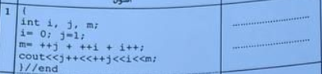 

 ```cpp 
#include <iostream>

using namespace std;

int main(){
    
    int i , j , m;

    i = 0 ; j = 1;
    m = ++j + ++i + i++;
    cout << j++ << ++j << i << m;


    return 0;
}  
```
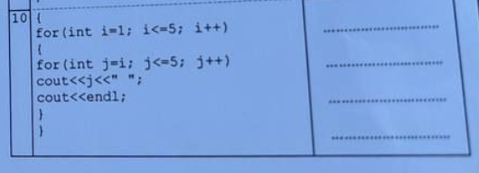 

 ```cpp 
#include <iostream>

using namespace std;

int main(){
    
   for(int i = 1; i<=5;i++){

    for(int j=i; j<=5;j++)
       cout << j << " ";
    cout << endl;  
   }

    return 0;
}  
```
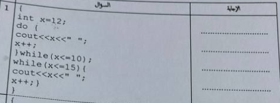 

 ```cpp 
#include <iostream>

using namespace std;

int main(){

   int x=12;

   do{
       cout << x << " ";
       x++;
       
   }while(x<=10);

   while(x<=15){
    cout << x << " ";
    x++;
   }

    return 0;
}  
```
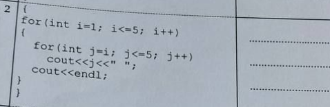 

 ```cpp 
#include <iostream>

using namespace std;

int main(){

    for(int i = 1;  i<= 5;i++){

        for(int j=i; j<=5;j++)
           cout << j << " ";

        cout << endl;
    }

  
    return 0;
}  
```
 

 ```cpp 
#include <iostream>

using namespace std;

int main(){
    
    float r ,s,t,v;

    r=0.1;
    s=0.2;
    t=0.3;
    for(r=0.2; r<=(0.1*10) ; r+=0.1)
        v=s+r;

    cout  <<  r   <<  s   <<  t   << v;


    return 0;
}  
```
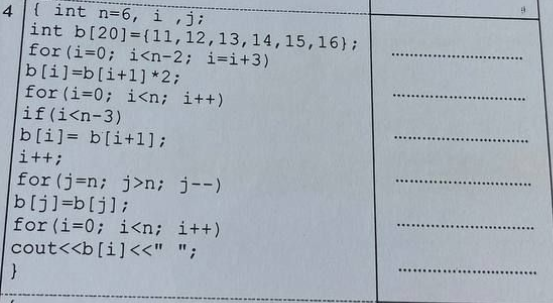 

 ```cpp 
#include <iostream>

using namespace std;

int main(){

    int n=6, i , j;

    int b[20] = {11 ,12,13,14,15,16};
    
    for(i=0;i<n-2;i=i+3)
     b[i] = b[i+1]*2;
    
    for(i = 0 ; i<n;i++)
        if(i<n-3)
         b[i] = b[i+1];
    
    i++;

    for(j=n ; j>n;j--)
      b[j] = b[j];
    
    for(i=0; i<n;i++)
      cout << b[i] << " ";

    return 0;
}  
```
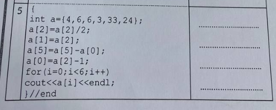 

 ```cpp 
#include <iostream>

using namespace std;

int main(){

     // int a = {4,6,6,3,33,24}; ///  خطأ بيخلي الكود كله ميخدمش الجواب لايطبع شيء
     

    return 0;
}  
```
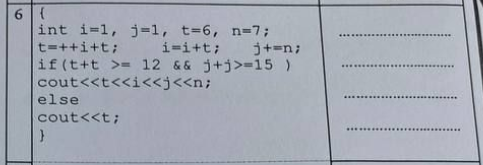 

 ```cpp 
#include <iostream>

using namespace std;

int main(){

    int i=1, j=1,t=6,n=7;

    t= ++i+t;
    i = i+t;
    j+=n;

    if(t+t >=12 && j+j>=15)
      cout<< t << i << j << n;
    
    else 
      cout << t ;

    return 0;
}  
```
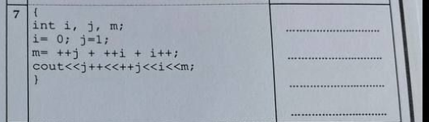 

 ```cpp 
#include <iostream>

using namespace std;

int main(){

    int i , j , m;

    i = 0 ; j = 1;

    m = ++j + ++i + i++;

    cout << j++ << ++j << i << m;

    return 0;
}  
```
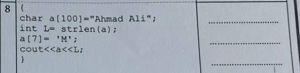 

 ```cpp 
#include <iostream>
#include <string.h> // بيش ننادو ال strlen
using namespace std;
int main(){
     //strlen دالة بتعد طول السلسلة بس 
     //ملاحظة مش مقررة علينا
  

     char a[100] = "Ahmed Ali";

     int L= strlen(a);

     a[7] = 'M';
     
     cout<<a<<L;

    return 0;
}  
```
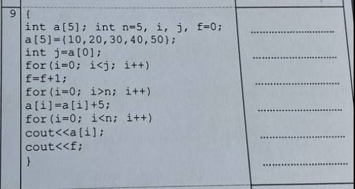 

 ```cpp 
#include <iostream>

using namespace std;

int main(){

   int a[5];
   int n=5, i , j , f=0;

   //a[5] = {10 ,20,30,40,50};  ///  خطأ بيخلي الكود كله ميخدمش الجواب لايطبع شيء

   


    return 0;
}  
```
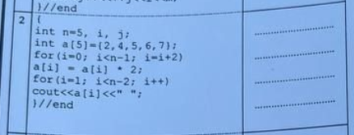 

 ```cpp 
#include <iostream>

using namespace std;

int main(){

     int n = 5 , i , j;

     int a[5] = {2 ,4,5,6,7};

     for(i = 0; i <n-1;i=i+2)
       a[i]= a[i] * 2;

     for(i = 1 ; i < n-2;i++)
      cout <<a[i] << " " ;
     

    return 0;
}  
```
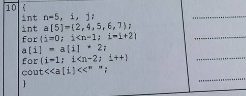 

 ```cpp 
#include <iostream>

using namespace std;

int main(){

     int n=5, i ,j;

     int a[5]= {2,4,5,6,7};

     for(i = 0 ; i<n-1;i=i+2)
      a[i] = a[i] *2;

     for(i = 1; i < n-2 ; i++)
      cout << a[i] << " ";


    return 0;
}  
```
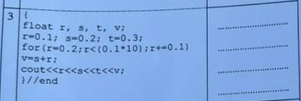 

 ```cpp 
#include <iostream>

using namespace std;

int main(){

   float r,s,t,v;

   r=0.1;s=0.2; t=0.3;

   for(r=0.2;r<(0.1*10);r+=0.1)
    v=s+r;
    
   cout << r << s << t <<v;

    return 0;
}  
```
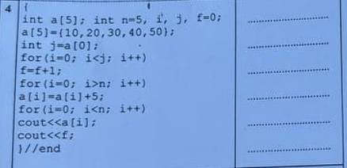 

 ```cpp 
#include <iostream>

using namespace std;

int main(){

   int a[5]; int  n=5 , i ,j,f=0;

   //a[5] = {10, 20,30,40,50};  ///  خطأ بيخلي الكود كله ميخدمش الجواب لايطبع شيء
   

    return 0;
}  
```
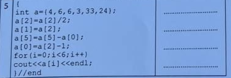 

 ```cpp 
#include <iostream>

using namespace std;

int main(){
         
     // int a = {4,6,6,3,33,24}; ///  خطأ بيخلي الكود كله ميخدمش الجواب لايطبع شيء

    return 0;
}  
```
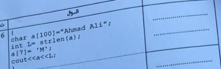 

 ```cpp 
#include <iostream>
#include <string.h> // بيش ننادو ال strlen
using namespace std;
int main(){
     //strlen دالة بتعد طول السلسلة بس 
     //ملاحظة مش مقررة علينا
    char a[100] = "Ahmed Ali";
    int L = strlen(a);
    a[7] = 'M';
    cout << a << L;

    return 0;
}  
```
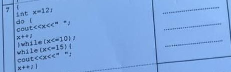 

 ```cpp 
#include <iostream>

using namespace std;

int main(){

    int x =12;

    do{

        cout << x << " ";
        x++;
    }while(x<=10);
    

    while(x<=15){
        cout << x << " ";
        x++;
    }

    return 0;
}  
```
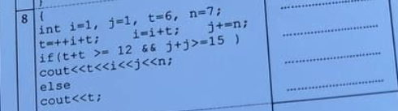 

 ```cpp 
#include <iostream>

using namespace std;

int main(){
      int i = 1, j=1,t=6,n=7;

      t=++i+t;
      i=i+t;
      j+=n;
      if(t+t >= 12 && j+j>=15)
        cout << t << i << j << n;
      else
       cout<<t;
      


    return 0;
}  
```
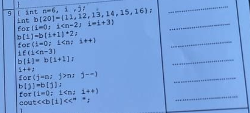 

 ```cpp 
#include <iostream>

using namespace std;

int main(){


 int n = 6 , i , j;

 int b[20]={11,12,13,14,15,16};


 for(i=0;i<n-2;i=i+3)
  b[i] = b[i+1] *2;

 for(i=0;i<n;i++)
  if(i<n-3)
    b[i]=b[i+1];

 i++;

 for(j=n;j>n ; j--)
    b[j]=b[j];
    
 for (i=0;i<n;i++)
    cout << b[i] << " ";


    return 0;
}  
```
</details>
<br id="GI131_final_Problem">
<details>      <summary><h3>نهائي - الأسئلة المقالية :</h3></summary>
      
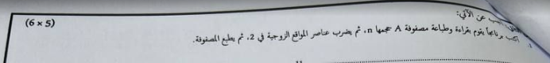 

 ```cpp 
#include <iostream>

using namespace std;

int main(){

     int A[1000] , N;

     cin >> N;

     for(int i = 0; i < N; i++) 
        cin >> A[i];

    for(int i = 0; i < N; i++)
        cout  << A[i] ;
    
    for(int i = 0; i < N; i++)
       if(i % 2 == 0) // لو الموقع الحالي زوجي
         A[i] *= 2; // يضرب قيمة عنصر الموقع الحالي ف 2

    for(int i = 0; i < N; i++)
        cout  << A[i];// طباعة المصفوفة بالقيم الجديدة


    return 0;
}  
```
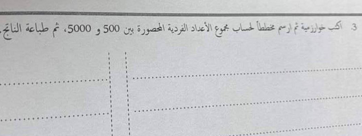 

 ```cpp 
#include <iostream>

using namespace std;

int main(){

    int sum = 0;

    for( int i= 501 ; i < 5000 ;i++)
      if(i%2 !=0)
        sum += i;
    

    cout << sum ;


    return 0;
}  
```
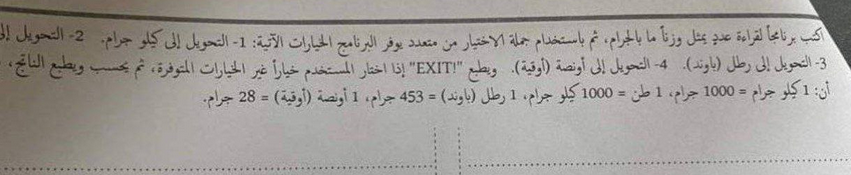 

 ```cpp 
#include <iostream>

using namespace std;

int main(){

   float grams  ;
   int choice; // متغير للخيار

   cin >> grams;

   cin >> choice;

   switch (choice)
   {
   case 1: // من الجرام للكيلو
    grams /= 1000;
    cout <<  grams << " kilogram" << endl;

    break;
   case 2: //الى الطن
    grams /= (1000*1000);
    cout <<  grams << " ton" << endl;

    break;
   case 3:// للباوند
    grams /= 453;
    cout <<  grams << " pound" << endl;

    break;
   case 4: // للأونصة
    grams /= 28;
    cout <<  grams << "  ounce" << endl;
    break;
   
   default:
    cout << "EXIT!";
   }


    return 0;
}  
```
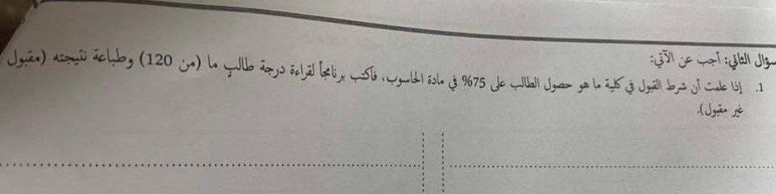 

 ```cpp 
#include <iostream>

using namespace std;

int main(){


    int a ; // درجة الطالب

    cin >> a;

    int requ  = 120 * 0.75 ; // بيش نعرفو كم درجة 75% من 120 بنضربوها ف 75 على 100 يلي هي 0.75
    
    if(a >=requ){
        cout << "accepted"; // مدرناهاش بالعربي لان مشاكل طباعة بالعربي بس

    }else{
        cout << "rejected";
    }
    
    return 0;
}  
```
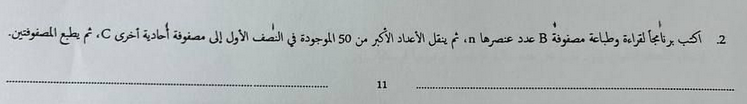 

 ```cpp 
#include <iostream>

using namespace std;

int main(){
    

    int B[1000] , C[1000] , N;
 
    
    cin >> N;


    for(int i = 0 ; i < N; i++)
     cin >> B[i];

    for(int i = 0 ; i < N; i++)
     cout << B[i] << " ";

    cout << endl;

    int tracker = 0; // بنتبعو بيه كم عنصر نقلنا
    int newSize = N; // بعد ننقلو العناصر B حجم المصفوفة 

    // B حلقة نبوها تلف ع النص الاول بس من المصفوفة 
    for(int i = 0 ; i < (N / 2) ; i++){

         
        // هنا درنا i - tracker
        // ك اينديكس للمصفوفات لان بعد نبدو نبلدو لازم نحسبو حساب العناصر يلي حولناها

        if(B[i-tracker] > 50 ){ // نتحققو هل العنصر الحالي اكبر من خمسين لان هذا شرط النقل
          //مثال
          //C[0]       B[0-0] 
          C[tracker] = B[i-tracker]; 
          // C بما اننا لقينا عنصر اكبر من خمسين ونسخناه ف 
          // لان قال نقل مش نسخ B لازم نحولوه من 
          // بنديروها بحلقة تعاود الترتيب بداية من العنصر يلي نقلناه لعند نهاية المصفوفة بحجمها بعد النقل
         
          newSize--; // ننقصو من الحجم الجديد 1

          for(int j = (i-tracker); j < newSize; j++) 
            B[j] = B[j+1]; // نخلو قيمة العنصر الحالي يلي تساوي يلي بعده 

          // وهكي هنا بنكونو سحبنا العنصر يلي نقلناه من للمصفوفة الجديدة
          
          //مثال 
          // B = [ 3 , 66  , 58 , 33] => B = [3 , 58, 33]
          // C = [] => C = [ 66]
             
          

          tracker++; // نزيدو متغير التتبع متاع النقل 1
       
        }
        
    }
     for(int i = 0 ; i < newSize; i++) // B نستخدمو الحجم الجديد ف طباعة المصفوفة 
     cout << B[i] << " ";
   
    cout << endl;
     
      for(int i = 0 ; i < tracker; i++) // C نستخدمو المتغير يلي حسبنا بيه عمليات النقل لان هذا حجم مصفوفة 
     cout << C[i] <<  " ";

    cout << endl;

    return 0;
}  
```
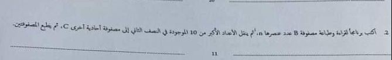 

 ```cpp 
#include <iostream>

using namespace std;

int main(){

    int B[1000] , C[1000] , n ;

     cin >> n;


    for(int i = 0 ; i < n; i++)
     cin >> B[i];

    for(int i = 0 ; i < n; i++)
     cout << B[i] << " ";

    cout << endl;


    int tracker = 0; // بنتبعو بيه كم عنصر نقلنا
    int newSize = n; // بعد ننقلو العناصر B حجم المصفوفة 

    // B حلقة نبوها تلف ع النص الثاني بس من المصفوفة 
    for(int i = (n / 2) ; i < n ; i++){
  
        // هنا درنا i - tracker
        // ك اينديكس للمصفوفات لان بعد نبدو نبلدو لازم نحسبو حساب العناصر يلي حولناها

        if(B[i - tracker] > 10){
           //مثال
          //C[0]        B[2-0] 
            C[tracker] = B[i-tracker];

           // C بما اننا لقينا عنصر اكبر من عشرة ونسخناه ف 
          // لان قال نقل مش نسخ B لازم نحولوه من 
          // بنديروها بحلقة تعاود الترتيب بداية من العنصر يلي نقلناه لعند نهاية المصفوفة بحجمها بعد النقل
         
            

            newSize--; // ننقصو من الحجم الجديد 1

           for(int j = (i-tracker); j < newSize; j++) 
            B[j] = B[j+1]; // نخلو قيمة العنصر الحالي يلي تساوي يلي بعده 
 
          // وهكي هنا بنكونو سحبنا العنصر يلي نقلناه من للمصفوفة الجديدة
          
          //مثال 
          // B = [ 3 , 13  , 15 , 3] => B = [3 , 13, 3]
          // C = [] => C = [ 15]

            tracker++;

        }
    }


    for(int i = 0 ; i < newSize; i++) // B نستخدمو الحجم الجديد ف طباعة المصفوفة 
     cout << B[i] << " ";
   
    cout << endl;
     
      for(int i = 0 ; i < tracker; i++) // C نستخدمو المتغير يلي حسبنا بيه عمليات النقل لان هذا حجم مصفوفة 
     cout << C[i] <<  " ";

    cout << endl;

    return 0;
}  
```
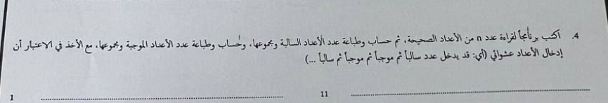 

 ```cpp 
#include <iostream>

using namespace std;

int main(){

    int number = 0 , n  , positiveSum = 0 , positiveCount = 0 ,
        negativeCount = 0 , negativeSum = 0;

    cin >> n;

    for(int i = 0 ; i< n ; i++){
        cin >> number;
         // ملاحظة استثنينا الصفر لان مش عدد صحيح و في السؤال مطلوب عدد صحيح
         if(number != 0) 
           
            if(number > 0){
               positiveCount++;
               positiveSum += number;

            }else{
               negativeCount++;
               negativeSum += number;
            }

       
    }
    //طريقة العرض مش مهمة بما انه نظري
    cout <<  positiveCount << positiveSum << negativeCount << negativeSum;


    return 0;
}  
```
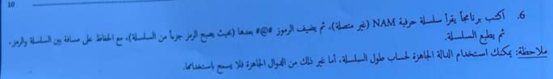 

 ```cpp 
#include <iostream>

using namespace std;

int main(){

    char nam[1000];
 
   cin >> nam; // لكن بما اننا مخديناهاش فلنظري بنستخدمو العادية cin.get() لو نبو ناخدو حتى المسافات فلأدخال لازم 
  
  
    // بنحسبو طولها بروحنا لان مرات يقول لاستاذ الدوال الجاهزة كلها لا 
    int length = 0;
    // null بيستمر يزيد الطول واحد ليلقى قيمة فاضية
    while (nam[length] != '\0') {
        length++;
    }

    // نضيفو المطلوب بعد يلي دخله المستخدم بعد حسبنا طوله
    nam[length] = ' '; // لان قال خلي مسافة 
    nam[length + 1] = '#';
    nam[length + 2] = '@';
    nam[length + 3] = '#';
    nam[length + 4] = '\0'; // بيش يعرف ان وقفنا هنا وميعطيش باقي العناصر الفاضية قيم عشوائية
    cout << nam << endl;
    
    return 0;
}  
```
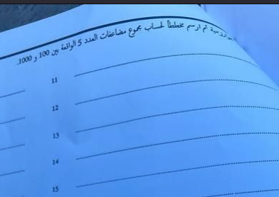 

 ```cpp 
#include <iostream>

using namespace std;

int main(){
    int sum = 0;
    for (int i = 101; i < 1000 ; i++){
        if (i % 5 == 0) { // لو قبل القسمة عليه يعني من مضاعفاته
            sum += i;
        }
    }    
    cout << sum << endl;

    return 0;
}  
```
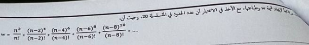 

 ```cpp 
#include <iostream>

using namespace std;

int main(){
    float w = 0  , n;

    cin >> n;
    
    for(int i = 0 ; i < 20 ; i++){ // حلقة بتلف 20 مره لان قال عشرين حد
        float first = n- (i*2) ; //  البسط

        float copy = first; // ناخدو منه نسخة بيش نرفعوله الأس
        first = 1; // بيش الأس كان صفر وملفتش الحلقة يخلي البسط 1
        for(int po = 0 ; po < ( (i*2) + 2) ; po++){ // زائد 2 n الأس عبارة عن العدد المطروح من 
            first *= copy; // نضربو البسط فنفسه
        }

        float second = n - (i*2) ; //المقام

        int mul = 1; // متغير نحسبو فيه المضروب
        for (int i = second ; i > 1; i--){ // نبدو من قيمة المقام ونقعدو ننزلو كل حلقة  لعند 2
            mul *= i ;  // i نضربو قيمة المضروب الحالية ف 
        }

        second = mul; // بعد طلعنا المضروب نرجعوه للمقام

       
       w += first / second ; // w نظيفو النتيجة للمتغير 


    }
      cout << w << endl;


    return 0;
}  
```
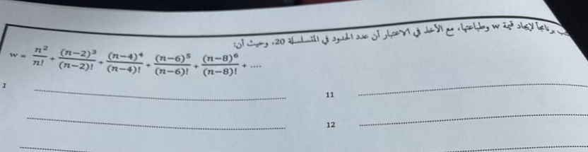 

 ```cpp 
#include <iostream>

using namespace std;

int main(){

float w = 0  , n;

    cin >> n;
    
    for(int i = 0 ; i < 20 ; i++){ // حلقة بتلف 20 مره لان قال عشرين حد
        float first = n - (i * 2) ; //  البسط

        float copy = first; // ناخدو منه نسخة بيش نرفعوله الأس
        first = 1; // بيش الأس كان صفر وملفتش الحلقة يخلي البسط 1
        for(int po = 0 ; po < ( i + 2) ; po++){ // 2 زائد  i  الأس عبارة عن 
            first *= copy; // نضربو البسط فنفسه
        }

        float second = n - (i*2) ; //المقام

        int mul = 1; // متغير نحسبو فيه المضروب
        for (int i = second ; i > 1; i--){ // نبدو من قيمة المقام ونقعدو ننزلو كل حلقة  لعند 2
            mul *= i ;  // i نضربو قيمة المضروب الحالية ف 
        }

        second = mul; // بعد طلعنا المضروب نرجعوه للمقام

       
       w += first / second ; // w نظيفو النتيجة للمتغير 


    }
    cout << w << endl;

    return 0;
}  
```
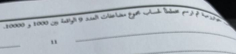 

 ```cpp 
#include <iostream>

using namespace std;

int main(){

    int sum = 0;
    for (int i = 1001; i < 10000 ; i++){
        if (i % 9 == 0) { // لو قبل القسمة عليه يعني من مضاعفاته
            sum += i;
        }
    } 
    cout << sum << endl;


    return 0;
}  
```
</details>
    
</details>
  
<br id="GI132" />    <details>      <summary dir="rtl"><h1>برمجة 2</h1></summary>            <ul>                      </ul> 
</details>
  
  