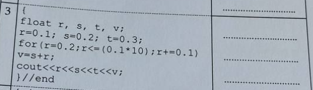

<div align="center">
    <h3 align="center">أسئلة امتحانات سابقة مع الحل</h3>
    <p align="center">
      لو عندك اسئلة زيادة او لاحظت خطأ تقدر تصلحه مباشرة او قوللنا ويتصلح
      <br />
      <a href="https://t.me/yourSpaece">قناة التلغرام</a>
      ·
      <a href="https://t.me/itstudents2024">قروب التلغرام</a>
    </p>
  </div>
    <h1>المواد :</h1>
    <ol dir="rtl">
      <li ><h3 ><a  href="#GI131"><b >برمجة 1</b></a></h3></li>
<li ><h3 ><a  href="#GI132"><b >برمجة 2</b></a></h3></li>
    </ol>
    <br id="GI131" />    <details>      <summary dir="rtl"><h1>برمجة 1</h1></summary>            <ul>                          <li>            <summary><b>أسئلة النهائي</b></summary>              <br />                        <ul>              <li><summary><a href="#GI131_final_Trace"><b>أسئلة التتبع</b></a></summary></li>              <li><summary><a href="#GI131_final_Problem"><b>أسئلة المقالي</b></a></summary></li>            </ul>         </li>      </ul> 
      <br id="GI131_final_Trace">
<details>      <summary dir="rtl"><h3>نهائي - أسئلة التتبع :</h3></summary>

 

 ```cpp 
#include <iostream>

using namespace std;

int main(){
    
    int i , j , m;

    i = 0 ; j = 1;
    m = ++j + ++i + i++;
    cout << j++ << ++j << i << m;


    return 0;
}  
```
 

 ```cpp 
#include <iostream>

using namespace std;

int main(){
    
   for(int i = 1; i<=5;i++){

    for(int j=i; j<=5;j++)
       cout << j << " ";
    cout << endl;  
   }

    return 0;
}  
```
 

 ```cpp 
#include <iostream>

using namespace std;

int main(){

   int x=12;

   do{
       cout << x << " ";
       x++;
       
   }while(x<=10);

   while(x<=15){
    cout << x << " ";
    x++;
   }

    return 0;
}  
```
 

 ```cpp 
#include <iostream>

using namespace std;

int main(){

    for(int i = 1;  i<= 5;i++){

        for(int j=i; j<=5;j++)
           cout << j << " ";

        cout << endl;
    }

  
    return 0;
}  
```
 

 ```cpp 
#include <iostream>

using namespace std;

int main(){
    
    float r ,s,t,v;

    r=0.1;
    s=0.2;
    t=0.3;
    for(r=0.2; r<=(0.1*10) ; r+=0.1)
        v=s+r;

    cout  <<  r   <<  s   <<  t   << v;


    return 0;
}  
```
 

 ```cpp 
#include <iostream>

using namespace std;

int main(){

    int n=6, i , j;

    int b[20] = {11 ,12,13,14,15,16};
    
    for(i=0;i<n-2;i=i+3)
     b[i] = b[i+1]*2;
    
    for(i = 0 ; i<n;i++)
        if(i<n-3)
         b[i] = b[i+1];
    
    i++;

    for(j=n ; j>n;j--)
      b[j] = b[j];
    
    for(i=0; i<n;i++)
      cout << b[i] << " ";

    return 0;
}  
```
 

 ```cpp 
#include <iostream>

using namespace std;

int main(){

     // int a = {4,6,6,3,33,24}; ///  خطأ بيخلي الكود كله ميخدمش الجواب لايطبع شيء
     

    return 0;
}  
```
 

 ```cpp 
#include <iostream>

using namespace std;

int main(){

    int i=1, j=1,t=6,n=7;

    t= ++i+t;
    i = i+t;
    j+=n;

    if(t+t >=12 && j+j>=15)
      cout<< t << i << j << n;
    
    else 
      cout << t ;

    return 0;
}  
```
 

 ```cpp 
#include <iostream>

using namespace std;

int main(){

    int i , j , m;

    i = 0 ; j = 1;

    m = ++j + ++i + i++;

    cout << j++ << ++j << i << m;

    return 0;
}  
```
 

 ```cpp 
#include <iostream>
#include <string.h> // بيش ننادو ال strlen
using namespace std;
int main(){
     //strlen دالة بتعد طول السلسلة بس 
     //ملاحظة مش مقررة علينا
  

     char a[100] = "Ahmed Ali";

     int L= strlen(a);

     a[7] = 'M';
     
     cout<<a<<L;

    return 0;
}  
```
 

 ```cpp 
#include <iostream>

using namespace std;

int main(){

   int a[5];
   int n=5, i , j , f=0;

   //a[5] = {10 ,20,30,40,50};  ///  خطأ بيخلي الكود كله ميخدمش الجواب لايطبع شيء

   


    return 0;
}  
```
 

 ```cpp 
#include <iostream>

using namespace std;

int main(){

     int n = 5 , i , j;

     int a[5] = {2 ,4,5,6,7};

     for(i = 0; i <n-1;i=i+2)
       a[i]= a[i] * 2;

     for(i = 1 ; i < n-2;i++)
      cout <<a[i] << " " ;
     

    return 0;
}  
```
 

 ```cpp 
#include <iostream>

using namespace std;

int main(){

     int n=5, i ,j;

     int a[5]= {2,4,5,6,7};

     for(i = 0 ; i<n-1;i=i+2)
      a[i] = a[i] *2;

     for(i = 1; i < n-2 ; i++)
      cout << a[i] << " ";


    return 0;
}  
```
 

 ```cpp 
#include <iostream>

using namespace std;

int main(){

   float r,s,t,v;

   r=0.1;s=0.2; t=0.3;

   for(r=0.2;r<(0.1*10);r+=0.1)
    v=s+r;
    
   cout << r << s << t <<v;

    return 0;
}  
```
 

 ```cpp 
#include <iostream>

using namespace std;

int main(){

   int a[5]; int  n=5 , i ,j,f=0;

   //a[5] = {10, 20,30,40,50};  ///  خطأ بيخلي الكود كله ميخدمش الجواب لايطبع شيء
   

    return 0;
}  
```
 

 ```cpp 
#include <iostream>

using namespace std;

int main(){
         
     // int a = {4,6,6,3,33,24}; ///  خطأ بيخلي الكود كله ميخدمش الجواب لايطبع شيء

    return 0;
}  
```
 

 ```cpp 
#include <iostream>
#include <string.h> // بيش ننادو ال strlen
using namespace std;
int main(){
     //strlen دالة بتعد طول السلسلة بس 
     //ملاحظة مش مقررة علينا
    char a[100] = "Ahmed Ali";
    int L = strlen(a);
    a[7] = 'M';
    cout << a << L;

    return 0;
}  
```
 

 ```cpp 
#include <iostream>

using namespace std;

int main(){

    int x =12;

    do{

        cout << x << " ";
        x++;
    }while(x<=10);
    

    while(x<=15){
        cout << x << " ";
        x++;
    }

    return 0;
}  
```
 

 ```cpp 
#include <iostream>

using namespace std;

int main(){
      int i = 1, j=1,t=6,n=7;

      t=++i+t;
      i=i+t;
      j+=n;
      if(t+t >= 12 && j+j>=15)
        cout << t << i << j << n;
      else
       cout<<t;
      


    return 0;
}  
```
 

 ```cpp 
#include <iostream>

using namespace std;

int main(){


 int n = 6 , i , j;

 int b[20]={11,12,13,14,15,16};


 for(i=0;i<n-2;i=i+3)
  b[i] = b[i+1] *2;

 for(i=0;i<n;i++)
  if(i<n-3)
    b[i]=b[i+1];

 i++;

 for(j=n;j>n ; j--)
    b[j]=b[j];
    
 for (i=0;i<n;i++)
    cout << b[i] << " ";


    return 0;
}  
```
</details>
<br id="GI131_final_Problem">
<details>      <summary dir="rtl"><h3>نهائي - الأسئلة المقالية :</h3></summary>
      
 

 ```cpp 
#include <iostream>

using namespace std;

int main(){

     int A[1000] , N;

     cin >> N;

     for(int i = 0; i < N; i++) 
        cin >> A[i];

    for(int i = 0; i < N; i++)
        cout  << A[i] ;
    
    for(int i = 0; i < N; i++)
       if(i % 2 == 0) // لو الموقع الحالي زوجي
         A[i] *= 2; // يضرب قيمة عنصر الموقع الحالي ف 2

    for(int i = 0; i < N; i++)
        cout  << A[i];// طباعة المصفوفة بالقيم الجديدة


    return 0;
}  
```
 

 ```cpp 
#include <iostream>

using namespace std;

int main(){

    int sum = 0;

    for( int i= 501 ; i < 5000 ;i++)
      if(i%2 !=0)
        sum += i;
    

    cout << sum ;


    return 0;
}  
```
 

 ```cpp 
#include <iostream>

using namespace std;

int main(){

   float grams  ;
   int choice; // متغير للخيار

   cin >> grams;

   cin >> choice;

   switch (choice)
   {
   case 1: // من الجرام للكيلو
    grams /= 1000;
    cout <<  grams << " kilogram" << endl;

    break;
   case 2: //الى الطن
    grams /= (1000*1000);
    cout <<  grams << " ton" << endl;

    break;
   case 3:// للباوند
    grams /= 453;
    cout <<  grams << " pound" << endl;

    break;
   case 4: // للأونصة
    grams /= 28;
    cout <<  grams << "  ounce" << endl;
    break;
   
   default:
    cout << "EXIT!";
   }


    return 0;
}  
```
 

 ```cpp 
#include <iostream>

using namespace std;

int main(){


    int a ; // درجة الطالب

    cin >> a;

    int requ  = 120 * 0.75 ; // بيش نعرفو كم درجة 75% من 120 بنضربوها ف 75 على 100 يلي هي 0.75
    
    if(a >=requ){
        cout << "accepted"; // مدرناهاش بالعربي لان مشاكل طباعة بالعربي بس

    }else{
        cout << "rejected";
    }
    
    return 0;
}  
```
 

 ```cpp 
#include <iostream>

using namespace std;

int main(){
    

    int B[1000] , C[1000] , N;
 
    
    cin >> N;


    for(int i = 0 ; i < N; i++)
     cin >> B[i];

    for(int i = 0 ; i < N; i++)
     cout << B[i] << " ";

    cout << endl;

    int tracker = 0; // بنتبعو بيه كم عنصر نقلنا
    int newSize = N; // بعد ننقلو العناصر B حجم المصفوفة 

    // B حلقة نبوها تلف ع النص الاول بس من المصفوفة 
    for(int i = 0 ; i < (N / 2) ; i++){

         
        // هنا درنا i - tracker
        // ك اينديكس للمصفوفات لان بعد نبدو نبلدو لازم نحسبو حساب العناصر يلي حولناها

        if(B[i-tracker] > 50 ){ // نتحققو هل العنصر الحالي اكبر من خمسين لان هذا شرط النقل
          //مثال
          //C[0]       B[0-0] 
          C[tracker] = B[i-tracker]; 
          // C بما اننا لقينا عنصر اكبر من خمسين ونسخناه ف 
          // لان قال نقل مش نسخ B لازم نحولوه من 
          // بنديروها بحلقة تعاود الترتيب بداية من العنصر يلي نقلناه لعند نهاية المصفوفة بحجمها بعد النقل
         
          newSize--; // ننقصو من الحجم الجديد 1

          for(int j = (i-tracker); j < newSize; j++) 
            B[j] = B[j+1]; // نخلو قيمة العنصر الحالي يلي تساوي يلي بعده 

          // وهكي هنا بنكونو سحبنا العنصر يلي نقلناه من للمصفوفة الجديدة
          
          //مثال 
          // B = [ 3 , 66  , 58 , 33] => B = [3 , 58, 33]
          // C = [] => C = [ 66]
             
          

          tracker++; // نزيدو متغير التتبع متاع النقل 1
       
        }
        
    }
     for(int i = 0 ; i < newSize; i++) // B نستخدمو الحجم الجديد ف طباعة المصفوفة 
     cout << B[i] << " ";
   
    cout << endl;
     
      for(int i = 0 ; i < tracker; i++) // C نستخدمو المتغير يلي حسبنا بيه عمليات النقل لان هذا حجم مصفوفة 
     cout << C[i] <<  " ";

    cout << endl;

    return 0;
}  
```
 

 ```cpp 
#include <iostream>

using namespace std;

int main(){

    int B[1000] , C[1000] , n ;

     cin >> n;


    for(int i = 0 ; i < n; i++)
     cin >> B[i];

    for(int i = 0 ; i < n; i++)
     cout << B[i] << " ";

    cout << endl;


    int tracker = 0; // بنتبعو بيه كم عنصر نقلنا
    int newSize = n; // بعد ننقلو العناصر B حجم المصفوفة 

    // B حلقة نبوها تلف ع النص الثاني بس من المصفوفة 
    for(int i = (n / 2) ; i < n ; i++){
  
        // هنا درنا i - tracker
        // ك اينديكس للمصفوفات لان بعد نبدو نبلدو لازم نحسبو حساب العناصر يلي حولناها

        if(B[i - tracker] > 10){
           //مثال
          //C[0]        B[2-0] 
            C[tracker] = B[i-tracker];

           // C بما اننا لقينا عنصر اكبر من عشرة ونسخناه ف 
          // لان قال نقل مش نسخ B لازم نحولوه من 
          // بنديروها بحلقة تعاود الترتيب بداية من العنصر يلي نقلناه لعند نهاية المصفوفة بحجمها بعد النقل
         
            

            newSize--; // ننقصو من الحجم الجديد 1

           for(int j = (i-tracker); j < newSize; j++) 
            B[j] = B[j+1]; // نخلو قيمة العنصر الحالي يلي تساوي يلي بعده 
 
          // وهكي هنا بنكونو سحبنا العنصر يلي نقلناه من للمصفوفة الجديدة
          
          //مثال 
          // B = [ 3 , 13  , 15 , 3] => B = [3 , 13, 3]
          // C = [] => C = [ 15]

            tracker++;

        }
    }


    for(int i = 0 ; i < newSize; i++) // B نستخدمو الحجم الجديد ف طباعة المصفوفة 
     cout << B[i] << " ";
   
    cout << endl;
     
      for(int i = 0 ; i < tracker; i++) // C نستخدمو المتغير يلي حسبنا بيه عمليات النقل لان هذا حجم مصفوفة 
     cout << C[i] <<  " ";

    cout << endl;

    return 0;
}  
```
 

 ```cpp 
#include <iostream>

using namespace std;

int main(){

    int number = 0 , n  , positiveSum = 0 , positiveCount = 0 ,
        negativeCount = 0 , negativeSum = 0;

    cin >> n;

    for(int i = 0 ; i< n ; i++){
        cin >> number;
         // ملاحظة استثنينا الصفر لان مش عدد صحيح و في السؤال مطلوب عدد صحيح
         if(number != 0) 
           
            if(number > 0){
               positiveCount++;
               positiveSum += number;

            }else{
               negativeCount++;
               negativeSum += number;
            }

       
    }
    //طريقة العرض مش مهمة بما انه نظري
    cout <<  positiveCount << positiveSum << negativeCount << negativeSum;


    return 0;
}  
```
 

 ```cpp 
#include <iostream>

using namespace std;

int main(){

    char nam[1000];
 
   cin >> nam; // لكن بما اننا مخديناهاش فلنظري بنستخدمو العادية cin.get() لو نبو ناخدو حتى المسافات فلأدخال لازم 
  
  
    // بنحسبو طولها بروحنا لان مرات يقول لاستاذ الدوال الجاهزة كلها لا 
    int length = 0;
    // null بيستمر يزيد الطول واحد ليلقى قيمة فاضية
    while (nam[length] != '\0') {
        length++;
    }

    // نضيفو المطلوب بعد يلي دخله المستخدم بعد حسبنا طوله
    nam[length] = ' '; // لان قال خلي مسافة 
    nam[length + 1] = '#';
    nam[length + 2] = '@';
    nam[length + 3] = '#';
    nam[length + 4] = '\0'; // بيش يعرف ان وقفنا هنا وميعطيش باقي العناصر الفاضية قيم عشوائية
    cout << nam << endl;
    
    return 0;
}  
```
 

 ```cpp 
#include <iostream>

using namespace std;

int main(){
    int sum = 0;
    for (int i = 101; i < 1000 ; i++){
        if (i % 5 == 0) { // لو قبل القسمة عليه يعني من مضاعفاته
            sum += i;
        }
    }    
    cout << sum << endl;

    return 0;
}  
```
 

 ```cpp 
#include <iostream>

using namespace std;

int main(){
    float w = 0  , n;

    cin >> n;
    
    for(int i = 0 ; i < 20 ; i++){ // حلقة بتلف 20 مره لان قال عشرين حد
        float first = n- (i*2) ; //  البسط

        float copy = first; // ناخدو منه نسخة بيش نرفعوله الأس
        first = 1; // بيش الأس كان صفر وملفتش الحلقة يخلي البسط 1
        for(int po = 0 ; po < ( (i*2) + 2) ; po++){ // زائد 2 n الأس عبارة عن العدد المطروح من 
            first *= copy; // نضربو البسط فنفسه
        }

        float second = n - (i*2) ; //المقام

        int mul = 1; // متغير نحسبو فيه المضروب
        for (int i = second ; i > 1; i--){ // نبدو من قيمة المقام ونقعدو ننزلو كل حلقة  لعند 2
            mul *= i ;  // i نضربو قيمة المضروب الحالية ف 
        }

        second = mul; // بعد طلعنا المضروب نرجعوه للمقام

       
       w += first / second ; // w نظيفو النتيجة للمتغير 


    }
      cout << w << endl;


    return 0;
}  
```
 

 ```cpp 
#include <iostream>

using namespace std;

int main(){

float w = 0  , n;

    cin >> n;
    
    for(int i = 0 ; i < 20 ; i++){ // حلقة بتلف 20 مره لان قال عشرين حد
        float first = n - (i * 2) ; //  البسط

        float copy = first; // ناخدو منه نسخة بيش نرفعوله الأس
        first = 1; // بيش الأس كان صفر وملفتش الحلقة يخلي البسط 1
        for(int po = 0 ; po < ( i + 2) ; po++){ // 2 زائد  i  الأس عبارة عن 
            first *= copy; // نضربو البسط فنفسه
        }

        float second = n - (i*2) ; //المقام

        int mul = 1; // متغير نحسبو فيه المضروب
        for (int i = second ; i > 1; i--){ // نبدو من قيمة المقام ونقعدو ننزلو كل حلقة  لعند 2
            mul *= i ;  // i نضربو قيمة المضروب الحالية ف 
        }

        second = mul; // بعد طلعنا المضروب نرجعوه للمقام

       
       w += first / second ; // w نظيفو النتيجة للمتغير 


    }
    cout << w << endl;

    return 0;
}  
```
 

 ```cpp 
#include <iostream>

using namespace std;

int main(){

    int sum = 0;
    for (int i = 1001; i < 10000 ; i++){
        if (i % 9 == 0) { // لو قبل القسمة عليه يعني من مضاعفاته
            sum += i;
        }
    } 
    cout << sum << endl;


    return 0;
}  
```
</details>
    
</details>
  
<br id="GI132" />    <details>      <summary dir="rtl"><h1>برمجة 2</h1></summary>      <h3>الفترة</h3>      <ul>                  <li>            <summary><b>أسئلة النصفي</b></summary>              <br />            <ul>              <li><summary><a href="#GI132_mid_Trace"><b>أسئلة التتبع</b></a></summary></li>              <li><summary><a href="#GI132_mid_Problem"><b>أسئلة المقالي</b></a></summary></li>            </ul>          </li>                  <li>            <summary><b>أسئلة النهائي</b></summary>              <br />                        <ul>              <li><summary><a href="#GI132_final_Trace"><b>أسئلة التتبع</b></a></summary></li>              <li><summary><a href="#GI132_final_Problem"><b>أسئلة المقالي</b></a></summary></li>            </ul>         </li>      </ul> 
      <br id="GI132_mid_Trace">
      <details><summary dir="rtl"><h3> نصفي - أسئلة التتبع :</h3></summary>
 

 ```cpp 
#include <iostream>

using namespace std;

int main(){
   int f,n,m,i ,a[1000];

   f=4;n=5;m=6;
   for(i = 0 ; i<n;i++){
    a[i]=f;
    f++;
   }
   for(i = 0 ; i<n;i++){
    a[i]=f;
    i++;
   }
   n--;
   for(i=n;i>0;i--){
    cout << a[i] << " ";
   }


    return 0;
}  
```
 

 ```cpp 
#include <iostream>

using namespace std;

int main(){
   int f,n,m,i,j ,a[1000];
   f=4;n=5;m=6;
   
   for(i=0;i<n;i++){
     n++;
     f=m;
     a[i]=f;
     for(j=i;j<i+1;j++){
        m=m+j;
        n--;
     }
   }
   for(i=0;i<n;i++){
     cout<<a[i]<<" ";
   }

    

    return 0;
}  
```
 

 ```cpp 
#include <iostream>

using namespace std;

int main(){
     int f,n,m,a[100][100],i,j;

     f=4;n=5;m=6;
     
     for(i=0;i<n;i++){
        for(j=0;j<m;j++){
            a[i][j]=i+1;
            f++;
        }
     }
     for(i=0;i<n;i++){
        for(j=0;j<m;j++){
            cout<<a[i][j]<<" ";
        }
        cout << " " << "*" << endl;
     }

    return 0;
}  
```
 

 ```cpp 
#include <iostream>

using namespace std;

int main(){

     int f,n,m,i,j;

     f=4;n=5;m=6;

     for(i=0;i<n;i++){
        m--;
        f++;
     }
     i++;
     n--;
     for(i=0;i<n;i++)
      cout << m << " " << f <<" "<< i << endl;


    return 0;
}  
```
 

 ```cpp 
#include <iostream>

using namespace std;

int main(){
    int f,n,m,i,x;

    f=4; n=5; m=6;

    for(i=0;i<n;i++){
        m=n+i;
        f++;
    }
    x=i+n+m+f;
    cout << x << endl;


    return 0;
}  
```
 

 ```cpp 
#include <iostream>

using namespace std;

int main(){

    int f,n,m,i,j;

    f=4;n=5,m=6;

    for(i=0;i<n;i++){
        for(j=f;j<m;j++){
            f=i+j;
            f++;
            i++;
            cout << f << " ";
        }
        cout << endl << "*";
    }
      

    return 0;
}  
```
</details>
      <br id="GI132_mid_Problem">
      <details><summary dir="rtl"><h3> نصفي - الأسئلة المقالية :</h3></summary>
 

 ```cpp 
#include <iostream>

using namespace std;
void read2DArray(int array[][100] , int rows , int columns){
    for(int i = 0; i < rows; i++)
        for(int j = 0; j < columns; j++)
            cin >> array[i][j];
}
void print2DArray(int array[][100] , int rows , int columns){
    for(int i = 0; i < rows; i++){
        for(int j = 0; j < columns; j++)
            cout <<array[i][j] << " ";
        cout << endl;
    }
}
void swabColumns(int B[][100], int rows , int columns ){
   int x ,y;
   //ناخدو قيمة x و y 
   //يلي هما مواقع الاعمدة يلي بنبدلو بيناتهم
   cin >> x >> y ;
   //بنقصو من المدخلات 1 بيش لو دخل المتسخدم واحد فالمصفوفة يكون 0 
   //لان اول عنصر فالمصفوفة 0
   x -= 1;
   y -= 1;

   // هنا بنلفو ع الصفوف
   for(int i = 0 ; i < rows ; i++) 
      //وهنا ع كل عمود فالصف الواحد 
      for(int j = 0 ; j < columns ; j++)
         // لو العنصر الحالي جزء من العمود يلي نبو نبدلوه يعني عموده يساوي أكس
         if(j == x) {
             //عملية تبديل متغيرين طبيعية
             int temp = B[i][x];
             B[i][x] = B[i][y];
             B[i][y] = temp;
         }
   
}

void sort2DArray(int B[][100], int rows , int columns ){
   
   // هنا بنلفو ع الصفوف
   for(int i = 0 ; i < rows ; i++) 
      //وهنا ع كل عمود فالصف الواحد اي كل عنصر فالصف
      // بما اننا بنغيرو العنصر الحالي ب يلي قدامها فحالة كان الحالي اصغر
      // فدرنا الفور الاولى توقف قبل اخر عنصر ب 1
      // لان لو مدرناهاش اخر عنصر بيتقارن مع عنصر غير معروف مش جزء من المصفوفة
      for(int j = 0 ; j < columns - 1 ; j++)
         //هنا بنقارنو العنصر الحالي يلي هو جي بكل العناصر الباقية فالصف هذا
         for (int s = 0; s < columns - 1; s++)
            // درنا لو العنصر الحالي اصغر من يلي بعده لان قال ترتيب تنازلي مش تصاعدي
                if (B[i][s] < B[i][s + 1])
                {
                    //عملية تبديل طبيعية
                    int temp = B[i][s];
                    B[i][s] = B[i][s + 1];
                    B[i][s + 1] = temp;
                }
}
int getSmallestNumberIn2DArray(int B[][100], int rows , int columns ){
    //نفترضو اول عنصر هو اصغر عنصر
   int smallest = B[0][0];
   // هنا بنلفو ع الصفوف
   for(int i = 0 ; i < rows ; i++) 
      //وهنا ع كل عمود فالصف الواحد 
      for(int j = 0 ; j < columns ; j++)
        // لو العنصر الحالي اكبر من اخر اصغر قيمة نخلوه هو اصغر قيمة
        if(B[i][j] > smallest)
            smallest = B[i][j];

   return smallest;
} 
//خدينا طول الصفوف بس لان هي مصفوفة مربعة يعني عدد الصفوف هو عدد الاعمدة
void calcE(int B[][100] , int X[][100] , int E[][100] , int rows){
  
   // هنا بنلفو ع الصفوف
  for(int i = 0 ; i < rows ; i++) 
      //وهنا ع كل عمود فالصف الواحد 
      for(int j = 0 ; j < rows ; j++)
        E[i][j] = B[i][j] + X[i][j];

}
int main(){
     
   int n ;
   int B[100][100] , X[100][100] , E[100][100];
   //ناخدو ابعاد المصفوفة
   cin >> n;
   //نبعتو للدالة المصفوفة و عدد اعمدتها و عدد صفوفها
   read2DArray(B , n , n);
   //طباعة المصفوفة
   print2DArray(B,n,n);
   //المطلوب الأول
   swabColumns(B , n , n );
   print2DArray(B,n,n);
   //المطلوب الثاني
   sort2DArray(B , n , n );
   print2DArray(B,n,n);
   //المطلوب الثالث
   int smallestNumber = getSmallestNumberIn2DArray(B , n , n);
   cout << smallestNumber << endl;
   //المطلوب الرابع
   //ناخدو عناصر X
   read2DArray(X , n , n);
   //حساب E
   calcE(B , X , E, n);
   // طباعة E
   print2DArray(E,n,n);


    return 0;
}  
```
 

 ```cpp 
#include <iostream>

using namespace std;
float fect(float x ){
    // بنخزنو الناتج التراكمي هنا
    float mul = 1;
    for(float i = x ; i > 1 ; i--)
      // لو اكس 5 بينضرب ف 5 بتولي مول 25 بعدين 25 ف 4 وهكذا لتوصل ال الأي 1 بنطلعو
      mul *= i;

    return mul;
}
//بناخدو قيمة اكس و الترتيب متاع المعادلة الحالية 
//ونطلعو منه البسط و المقام لانهم نفس المعادلة (بدون تربيع او مضروب)
float genFormula(float x , float index){
    //index = 0 => x-1
    //index = 1 => x-2 ...
    return x - index + 1;
}
float genPower(float index){
    //index = 0 => 1 
    //index = 1 => 3 ...
    if(index == 0) return 1;
    return index + 2 ;
}
float calcPower(float x , int power){
        float temp = 1; // بيش الأس كان صفر وملفتش الحلقة يخلي القيمة 1
        for(float po = 0 ; po < power ; po++){ //لو الأس صفر الحلقة هذي مش حتخدم
            temp *= x; // نضربو القيمة ف أكس
        }
        return temp; 
}
float getSum(float x   , float n ){
   float sum = 0 ;
   //الإن محسوبة معانا هذا ليش درنا او يساوي 
   //ايه في خطأ مطبعي فصورة السؤال البسط و المقام إن
   for(int i = 0 ; i <= n ;i++){
    // نجيبو المعادلة
     float foumula =  genFormula(x , i);
     //نجيبو كم قيمة الأس
     float power = genPower( i);
     // قيمة البسط بعد رفع المعادلة للأس يلي حصلناه
     float  first = calcPower(foumula,power);
     //نجيبو المقام بأننا نجيبو مضروب المعادلة
     float second = fect(foumula);
     // نزيدو ناتج قسمتهم ع المجموع
     sum += (first / second);
   }
   //نرجعو المجموع للماين
   return sum;
}
int main(){
     
    float x  ,n ,sum ;
    cin >> x >> n;
    //نجيبو قيمة المتسلسلة
    sum = getSum(x , n);
    cout << sum;
    return 0;
}  
```
 

 ```cpp 
#include <iostream>
#include <string.h> // بيش ننادو ال strlen

using namespace std;

void removeCharacter( char name[100] , char character    ){
    //هنا نبيك تركز معايا **********
    //جبنا طول الاسم بدالة الجاهزة المسموحة
    int n = strlen( name );
    //بنلفو ع حروف الأسم
    for (int i = 0; i < n; i++)
      // لو الحرف الحالي مساوي للحرف يلي بنحذفوه
      if( name[i] == character)
      {
        //بنوخرو كل الحروف يلي بعده خطوة بحيث انه الحرف يلي بعده بياخد مكانه
        for ( int j = i ; j < n - 1 ; j++ )
           name[j] = name[j+1];

        // هنا الجزء المهم

        // هنا قلنا للكومبايلر ان الموقع يلي كان اخر حرف فلأسم ولا نهايتها
        // \0 نهاية النص فشار بتكون 
        name[n - 1] = '\0';
        //بنعاودو ننادو الدالة بنفس المدخلات لكن بعد نقص الطول 1 
        return removeCharacter(name , character );
      }
}
int main(){
    char name[100] , character;
   
    //خدينا من المستخدم الاسم
    cin.getline(name, 100);
    //طبعنا الاسم زي مقال فسؤال
    cout << name << endl;
    //بنجيبو الحرف يلي المستخدم يبي يحذفه
    cin >> character;
    //بنحذفو الحرف من الاسم مهما كان عدد المرات يلي تكرر فيها
    removeCharacter( name , character  );
    //نطبعو النتيجة
    cout << name;

    return 0;
}  
```
 

 ```cpp 
#include <iostream>

using namespace std;

int genPower(int index){
    //index = 1 => 2 
    //index = 2 => 4 ...

    return index  * 2 ;
}
int calcPower(int x , int power){
        int temp = 1; // بيش الأس كان صفر وملفتش الحلقة يخلي القيمة 1
        for(int po = 0 ; po < power ; po++){ //لو الأس صفر الحلقة هذي مش حتخدم
            temp *= x; // نضربو القيمة ف أكس
        }
        return temp; 
}
int getSum(int x   , int y ,int   X ){
    //بدينا من ال 100 يلي قال عليها ف أكس 
   int sum = X ;
   // بدينا من ال 1 لان مش محتاجين لما تكون 0
   // بنوقفو قبل ما ال الأي تساوي اكس لان فالمتستسلة مجموع طرحها من الأكس فلأخير لازم يساوي 1
   for(int i = 1 ; i < x ;i++){
     int  first = x - i ;
     //نجيبو كم قيمة الأس
     int power = genPower( i);
     // قيمة أول حد من العملية
      first = calcPower(first,power);
     // قيمة ثاني حد مرفوع لأس اعلى من اس اول حد بواحد
     int second = calcPower(y ,power+1);
     // نزيدو ناتج جمعهم ع المجموع
     sum += (first + second);
   }
   //نرجعو المجموع للماين
   return sum;
}
int main(){
    // c++ حساسة لحالة لحروف
    // X != x
    int sum  , X= 100 , x ,y ;
    cin >> x >> y ;

    sum = getSum(x,y,X);
    cout << sum ;
    


    return 0;
}  
```
 

 ```cpp 
#include <iostream>
#include <string.h> // بيش ننادو ال strlen

using namespace std;

int findSpaceIndex(char name[100]){
      //طول الإسم
      int n = strlen(name);
      // لشرط بس
      int i = 0;
      while (i < n){
         // لو لقي المسافة يطلع من الدالة ويرجع موقعها
        if (name[i] == ' ')
          return i;
        i++;
      }
      // لو تم الإسم وملقاهاش يرجع -1 لان لازم نرجعو شي
      return -1;
      
}
void copy( char A[100] , char B[100]){
    // الطول الجديد
    int n = strlen(A);
    // نقل عناصر زي اي مصفوفة
    for(int i = 0 ; i < n ; i++){
     
        B[i] = A[i];
    }
    // نحددو ان هذي نهاية المتغير المنسوخ الجديدة
    B[n] = '\0';
}
void appendFatherName(char name[100] , char father[100]){
    // بنجمعو الاسم هنا مؤقتا
    char fullName[100];
    // نعرفو طول الاسم و اللقب بدالة المسموحة
    int n = strlen(name);
    // طول اسم الأب
    int fatherNameLength = strlen(father);
    // بيش نعرفو طول الاسم بروحه و طول اللقب بروحه 
    //الدالة هذي بتلقا المسافة يلي بيناتهم وتعطينا موقعها
    //يلي قبلها الأسم ويلي بعدها هو اللقب
    int spaceIndex = findSpaceIndex(name);
    // بيش نعرفو وين بيتم اسم الأب جمعنا طول اسم الأب مع موقع المسافة
    // ملاحظة ان موقع المسافة بعد الأسم الاول ب 1
    // يعني هكي حسبتنا صح لان الطول لازم يكون زايد ب 1
    int fatherEndIndex = fatherNameLength + spaceIndex ;

    // نبدو تكوين الاسم الجديد
    //في المصفوفات N هذا الإسم الأول بنوقفو زي مقلنا قبل موقع المسافة نقدرو نعتبروه 
    for(int i = 0 ; i < spaceIndex ; i++){
        fullName[i] = name[i];
    }
    // توا مكان المسافة الاولى بنحطو مسافة بيش متلصقش الدنيا
    fullName[spaceIndex] = ' ';
    // توا بنضيفو اسم الأب
    //بنبدو من اول موقع بعد المسافة يلي ضفناها
    // وبنوقفو فنهاية اسم الأب لاحظ ان اصغر من او يساوي لان نبو كل حرف
    for(int i = spaceIndex + 1 ; i <= fatherEndIndex; i++){
                      // المبدئية i هتا بيش تبدو من بداية اسم الأب لغينا قيمة 
                      //يعني بيكون هكي father[0] , father[1] ...
        fullName[i] = father[i - spaceIndex - 1];
    }
    // توا بعد الإسم متاع الاب بنزيدو مسافة
    fullName[fatherEndIndex + 1] = ' ';
    // (n) نحددو موقع نهاية المصفوفة يعني بالعربي طولها الجديد 
    // الزائد 1 هذي بسبب اننا زدنا مسافة بين اسم الأب و الإسم الأول
    int fullNameEnd = n + fatherNameLength + 1;
    // بنبدو نضيفو اللقب وبنبدو من بعد اخر مسافة ضفناها
    // n ونوقفو قبل الطول الجديد يعني كأنها 
    for(int i = fatherEndIndex + 2 ; i < fullNameEnd ;i++){
                      //نبو نرجعو للقب فالمتغير الاول
                      //فنقصنا يلي زدناه ويلي هو 1 متاع المسافة و طول اسم الأب
        fullName[i] = name[i - fatherNameLength - 1];
    }
    //نقولو للكومبايلر ان هذي نهاية الإسم
    fullName[fullNameEnd] = '\0';
    // توا ننسخو الاسم الكامل للإسم الأول لان الإسم الكامل مؤقت بس
    // اعلنا عليه هنا ف بينحذف اول متتم الدالة هذي
    copy(fullName , name);
}


int main(){
    char name[100];
    char father[100];

    // ناخدو الاسم و اللقب
    cin.getline(name, 100);
    //طبعناهم زي مطلب فسؤال
    cout << name << endl;
    //ناخدو اسم الأب
    cin.get(father,100);
    // نضيفو اسم الأب بين اللقب و الاسم
    appendFatherName(name , father );
    // نطبعو الإسم الكامل
    cout << name << endl;
    return 0;
}  
```
 

 ```cpp 
#include <iostream>

using namespace std;
void read2DArray(int array[][100] , int rows , int columns){
    for(int i = 0; i < rows; i++)
        for(int j = 0; j < columns; j++)
            cin >> array[i][j];
}
void print2DArray(int array[][100] , int rows , int columns){
    for(int i = 0; i < rows; i++){
        for(int j = 0; j < columns; j++)
            cout <<array[i][j] << " ";
        cout << endl;
    }
}

void swabMainD( int F[][100], int n){
   int x ;
   cin >> x;
   //بنقصو من المدخلات 1 بيش لو دخل المتسخدم واحد فالمصفوفة يكون 0 
   //لان اول عمود فالمصفوفة 0
   x -= 1;
   // هنا بنلفو ع الصفوف
   for(int i = 0; i < n; i++)
        //وهنا ع كل عمود فالصف الواحد 
        for(int j = 0; j < n; j++)
             //لو الصف يساوي العمود معناها حني فالقطر الرئيسي
            if(j == i ){
                 //عملية تبديل بين العنصر يلي فالصف الحالي فالقطر الرئيسي 
                 // و العنصر فالصف الحالي فالعمود المطلوب
                 int temp = F[i][x];
                 F[i][x] = F[i][j] ;
                 F[i][j] = temp;
            }
}
int sumHalfArray( int F[][100], int n){

   int sum = 0;

   for(int i = 0; i < n; i++)
        // هكي بنوقفو فنص المصفوفة يعني العناصر يلي ع ليسار بس
        for(int j = 0; j < (n / 2); j++)
             //نضيفو العنصر للمجموع
           
                 sum += F[i][j];
            
    return sum;
} 

int findSmallestNumberInSubD ( int F[][100] , int n){
    //نفترضو ان اول قيمة فالقطر الفرعي هي اصغر قيمة
    int smallest = F[0 ][n - 1]; 

    for(int i = 0 ; i < n ; i++) 
        for(int j = 0 ; j < n ; j++)
            // القطر الفرعي هو لما مجموع الصف زائد العمود يساوي طول المصفوفة زائد 1
            //لكن بما اننا فبرمجة مش رياضة  المصفوفة عندنا تبدا من 0 مش 1
            //ف بيش نوازنو المعادلة جمعنا الصف مع العمود و تحققنا هل يساوو الطول ناقص 1
            //مثال
            // في الرياضة 3+1 = 4 في حالة المصفوفة طولها 3
            // في البرمجة 2+0 = 2 في حالة المصفوفة طولها 3

            //ولو تحقق الشرط نشوفو هل اصغر من اخر اصغر قيمة عندنا
            if((i+j) == n-1  && F[i][j] < smallest)
                smallest = F[i][j];

  
    return smallest;
}
void calcD (int F[][100] , int D[][100] , int n){
      int x;
      // ناخدو قيمة x 
      cin >> x;

      for(int i = 0; i < n; i++)
        for(int j = 0; j < n; j++)
             // الصف الثاني نضربو القيمة ف أكس
             if(i == 1)
              D[i][j] = F[i][j] * x;
             else
              // لو اي صف ثاني نحطوها كيف ماهيا
              D[i][j] = F[i][j];
}

int main(){

   int n ;
   int F[100][100]  , D[100][100];
   //ناخدو ابعاد المصفوفة
   cin >> n;
   //نبعتو للدالة المصفوفة و عدد اعمدتها و عدد صفوفها
   read2DArray(F , n , n);
   //طباعة المصفوفة
   print2DArray(F,n,n);
   //المطلوب الأول
   // تبديل عمود بالقطر الرئيسي
   swabMainD(F , n);
   print2DArray(F,n,n);
   //المطلوب الثاني
   int sum = sumHalfArray(F , n);
   cout << sum;
   //المطلوب الثالث
   //واخد راحتي فلاسماء شوية مش مهم :)
   // هذا بيلقى اصغر قيمة فالقطر الفرعي
   int smallestValue = findSmallestNumberInSubD(F , n);
   cout << smallestValue;
   //المطلوب الرابع
   calcD(F ,D, n);
   print2DArray(D , n , n);

    return 0;
}  
```
</details>
      <br id="GI132_final_Trace">
<details>      <summary dir="rtl"><h3>نهائي - أسئلة التتبع :</h3></summary>


</details>
<br id="GI132_final_Problem">
<details>      <summary dir="rtl"><h3>نهائي - الأسئلة المقالية :</h3></summary>
      
 

 ```cpp 
#include <iostream>

using namespace std;
void read2DArray(int array[][100] , int rows , int columns){
    for(int i = 0; i < rows; i++)
        for(int j = 0; j < columns; j++)
            cin >> array[i][j];
}
void calculateA (int A[][100] , int rows , int columns){
    for(int i = 0; i < rows; i++)
        for(int j = 0; j < columns; j++)
            //لو الصف زوجي و العنصر فردي
            if(i % 2 == 0 && A[i][j] % 2 != 0)
                A[i][j] *= 5;
            
             
}

void print2DArray(int array[][100] , int rows , int columns){
    
    for(int i = 0; i < rows; i++){
        for(int j = 0; j < columns; j++)
            cout << array[i][j] << " ";

    
        cout << endl;
        
    }

}

int main(){
    

    int A[100][100] ;
    int N , M;
    cin >> N >> M;
    read2DArray(A , N,M);
    calculateA(A , N , M);
    print2DArray(A , N , M);


    return 0;
}  
```
 

 ```cpp 
#include <iostream>

using namespace std;
void print(int A[] , int n){
    
    for(int i = 0 ; i < n ; i++) 
        cout << A[i] << " ";
    
    cout << endl;
 
}

void readArray(int A[] , int n){
    
    for(int i = 0 ; i < n ; i++) 
        cin >> A[i];
}

int Trans(int A[] , int B[] , int n , int bSize){
     // n النصف الاول ف بنوقفو عن نص 
    for (int i = 0 ; i < n/2 ; i++) 
      // لو العنصر الحالي اصغر من 50
      if(A[i] < 50){
        // B ننسخوه ل 
        B[bSize] = A[i];
        //واحد B نزيدو حجم 
        bSize++;
      }
    //نرجعو الحجم الجديد
    return bSize;
}

//في حالة نسخ مش نقل متدورهاش الدالة هذي
int reFormatArray(int A[] , int n){
    //مع اضافة بسيطة Trans نفس الكلام متاع دالة 
    for(int i = 0 ; i < n/2 ; i++)
        if(A[i] < 50){
           for(int j = i ; j < n ;j++)
            A[j] = A[j+1];
            //تقريبا شرحتها فأسئلة النصفي الفكرة
           //بنقعدو كل ما ننقلو ننقصو من الطول 1 والدالة بتعاود تنادي نفسها
           // بيش تبدا من جديد بالطول الجديد
           return reFormatArray(A , n-1);
        }
    // لو ملقتش ولا واحد يعني نقلتهم كلهم ترجع الحجم الجديد
    return n;
} 
int main(){

    int n ,A[1000] , B[1000] , bSize= 0;
    
    cin >> n;

    readArray(A,n);
    // الجديد B ونرجعو حجم  B ل A  ننقلو العناصر من 
    bSize = Trans(A , B, n , bSize);
    // ونرجعو حجمها الجديد A نحولو العناصر يلي نقلناهم من 
    n = reFormatArray(A,n);
    // A نطبعو
    print(A,n);
    // B نطبعو
    print(B,bSize);
    


    return 0;
}  
```
 

 ```cpp 
#include <iostream>

using namespace std;

void read2DArray(int array[][100] , int rows , int columns){
    
    for(int i = 0; i < rows; i++){
        for(int j = 0; j < columns; j++){ 
             // الكلام الجديد هنا
             // *(array + i) == array[i]
             // *(*(array + i) + j) == array[i][j]
            cin >> *( *(array + i) + j);
        }
    }

}

 
void printCurrentRow(int array[][100] , int row , int columns ){
     for(int i = 0; i < columns; i++)
        //  *( *(array + row) + i) == array[row][i]
       cout <<  *(*(array + row) + i) << " ";
     cout << endl;
 
}

void Search(int array[][100] , int rows , int columns , int x){
   
   for(int i = 0; i < rows; i++)
        for(int j = 0; j < columns; j++)
            // x لو العنصر لحالي يساوي 
            // نطبعو الصف متاعها كامل
            if( *( *(array + i) + j) == x)
             return printCurrentRow(array , i , columns);
    // لو ملقيناهش
    cout << "NO" ;


}


int main(){

    int A[100][100];

     int rows , cols , x ;

     cin >> rows >> cols >> x ;
     // نقرو المصفوفة بالمؤشرات
     // ببساطة بنوصلو لعناصر المصفوفة عن طريق نقطة معينة فالمصفوفة
     // بينهم مسافة ثابتة ع حسب نوع متغيراتها (stack) لان المصفوفات عناصرهم مواقعهم فذاكرة  
     //قبل متكمل فباقي الأسئلة متاعهم (pointers) مش احسن شرح لكن لازم تكون فاهم المؤشرات   
    read2DArray(A,rows,cols);
    
    Search(A,rows,cols ,x);


    return 0;
}  
```
 

 ```cpp 
#include <iostream>

using namespace std;

void read2DArray(int array[][100] , int rows , int columns){
    
    for(int i = 0; i < rows; i++){
        for(int j = 0; j < columns; j++){ 
             // *(array + i) == array[i]
             // *(*(array + i) + j) == array[i][j]
            cin >> *( *(array + i) + j);
        }
    }

}

void print2DArray(int array[][100] , int rows , int columns){
    
    for(int i = 0; i < rows; i++)
        for(int j = 0; j < columns; j++)
            cout << array[i][j] << " ";

    
        cout << endl;
        
    

}

void print1DArray(int array[] , int columns){

        for(int i = 0; i < columns; i++)
            cout << array[i]<< " ";

        cout << endl;

}

void Throw (int array[][100] , int rows , int columns ) {

    int result[100];
    // طول المصفوفة الاحادية
    int tracker = 0;

    for(int i = 0; i < rows; i++){
       // نضيفو للمصفوفة الاحادية العنصر الحالي من الصف الأخير
       // results[tracker] = array[columns - 1][i];
       *(result + tracker) = *(*(array  + columns - 1) + i );
        //نزيدو طولها
        tracker++;
    }
   // نطبعو المصفوفة الثنائية
   print2DArray(array, rows , columns);
   cout << endl;
   //  نطبعو المصفوفة الجديدة الاحادية
   print1DArray(result, columns);

}
int main(){ 

    // لو مش فاهم المؤشرات شوف الملاحظة ف سؤال 3

    int array[100][100] , rows , columns;
    cin >> rows >> columns;
    
    read2DArray(array , rows , columns);
     
    Throw(array , rows , columns);

    return 0;
}  
```
 

 ```cpp 
#include <iostream>

using namespace std;


void print2DArray(int array[][500] , int rows , int columns){
    
    for(int i = 0; i < rows; i++){
        for(int j = 0; j < columns; j++)
            cout <<*( *(array+i)+j) << " ";

    
        cout << endl;
        
    }

} 

void Add(int arrayA[][100], int aRows , int aCols , int arrayB[][100], int bRows , int bCols){
    int result[500][500];
    // نفترضو اكبر صف و عمود هم متاع اول مصفوفة
    int biggestRows =aRows , biggestCols =aCols;
    //  اكبر يخليهم هم الاكبر b لو طول اعمدة او صفوف 
    if(aRows < bRows)
      biggestRows = bRows;
    if(aCols < bCols)
      biggestCols = bCols;

    //بنديرو حلقتنا ع اساس الاكبر
    for(int i = 0; i < biggestRows; i++){
        for(int j = 0; j < biggestCols; j++){
            int sum = 0;
            // ف حالة كانت هي اصغر a نتأكدو اننا مطلعناش من طول المصفوفة 
            if(i < aRows && j < aCols)
              sum += *( *(arrayA+i)+j) ;
            // ف حالة كانت هي اصغر b نتأكدو اننا مطلعناش من طول المصفوفة 
            if(i < bRows && j < bCols)
              sum += *( *(arrayB+i)+j);
           // نخزنو نتيجة جمعهم فالمصفوفة الجديدة
           *( *(result+i)+j) = sum;
        }
    }
    // نطبعو مصفوفة المجموع
    print2DArray(result , biggestRows , biggestCols);
}
void read2DArray(int array[][100] , int rows , int columns){
    
    for(int i = 0; i < rows; i++){
        for(int j = 0; j < columns; j++){
            cin >> *(*(array + i) + j);
        }
    }

}
int main(){
    // لو مش فاهم المؤشرات شوف الملاحظة ف سؤال 3

    int aArray[100][100] , bArray[100][100] , aRows,aCols,bRows,bCols;

    cin >> aRows >> aCols >> bRows >> bCols;
    // نطبعو كل مصفوفة ب ابعادها
    read2DArray(aArray,  aRows, aCols);
    read2DArray(bArray,  bRows, bCols);

    Add(aArray, aRows, aCols, bArray, bRows, bCols);


    return 0;
}  
```
 

 ```cpp 
#include <iostream>
#include <string.h> // بيش ننادو ال strlen
using namespace std;


void readNames(char names[][100] ,int n){
    //نحولو اي مسافة فالكونسل بيش ميحسبهاش ادخال 
    cin.ignore();
        //ناخدو الاسماء
    for(int i = 0 ; i < n ; i++){
        cin.getline(names[i] , 100);
       
    }
      
    
}
void mergeCodes(char name[100] ,char code[100]){
    //نجيبو طول الاسم و الكود
    int n = strlen(name);
    int m = strlen(code);
    name[n] = ' ';
    for (int i = 0 ; i < m ; i++)
      // نحطو الكود فنهاية الإسم
      name[i+n+1] = code[i];
    //نحددو نهاية الإسم الجديدة
    name[m +n+1] = '\0';
}
void readCodes(char names[][100] , int n ){
    for(int i = 0 ; i < n ; i++){
        //متغير مؤقت للكود
        char code[50];
        cin.getline(code , 100);
        //ندمجو الإسم و الكود
        mergeCodes(names[i],code);
       
    }
}

void printNames(char names[][100], int n){

    for(int i = 0 ; i < n ; i++){
        cout << names[i] << endl;
    }
}
int main(){
    char names[100][100]  , codes[100][100];
    int n;

    cin >> n;
    // ناخدو الأسماء من المستخدم
    readNames(names, n);
    //  بعدها الأكواد متاع المواد ويدمجهم مع اسم المادة
    readCodes(names, n);
    // نطبعو النتيجة
    printNames(names, n);
    
    return 0;
}  
```
 

 ```cpp 
#include <iostream>

using namespace std;

void read2DArray(int array[][100] , int rows , int columns){
    
    for(int i = 0; i < rows; i++)
        for(int j = 0; j < columns; j++)
            cin >> array[i][j];
} 
void print2DArray(int array[][100] , int rows , int columns){
    
    for(int i = 0; i < rows; i++){
        for(int j = 0; j < columns; j++)
            cout << array[i][j] << " ";

        cout << endl;
    }
}

void calculateD(int C[][100] , int D[][100], int rows , int columns){
    for(int i = 0; i < rows; i++){
        for(int j = 0; j < columns; j++){
            if(j % 2 == 0) // لو العمود زوجي
                D[i][j] = C[i][j];
            else // مش واضحة الصورة اظن انها 4 🥸
                D[i][j] = 4;
        }
    }
}
void sort2DArrayRows(int array[][100], int rows , int columns){
    int temp;
    for(int i = 0; i < rows; i++)
        for(int j = 0; j < columns - 1; j++)
           // نفس ترتيب اي مصفوفة احادية ودرناها فأسئلة النصفي 
            for (int s = 0; s < columns - 1; s++)
                if (array[i][s] > array[i][s + 1])
                {
                    temp = array[i][s];
                    array[i][s] = array[i][s + 1];
                    array[i][s + 1] = temp;
                }    
}
void calculateE(int C[][100] , int D[][100] , int E[][100], int rows , int columns){
    for(int i = 0; i < rows ; i++)
        for(int j = 0; j < columns; j++)
            //نجمعوهم ببساطة سؤال هدية
            E[i][j] = C[i][j] + D[i][j] + 4;
        
}
int main(){
     int cRows , cCols;
     int C[100][100] , D[100][100] , E[100][100];
     
     cin >> cRows >> cCols;
     read2DArray(C , cRows , cCols);
     //أ
     calculateD(C , D , cRows , cCols);
     print2DArray(D , cRows , cCols);
     //ب
     calculateE(C , D , E , cRows , cCols);
     print2DArray(E , cRows , cCols);
     //ج
     sort2DArrayRows(C , cRows , cCols);
     print2DArray(C , cRows , cCols);

    return 0;
}  
```
</details>
    
</details>
  
  